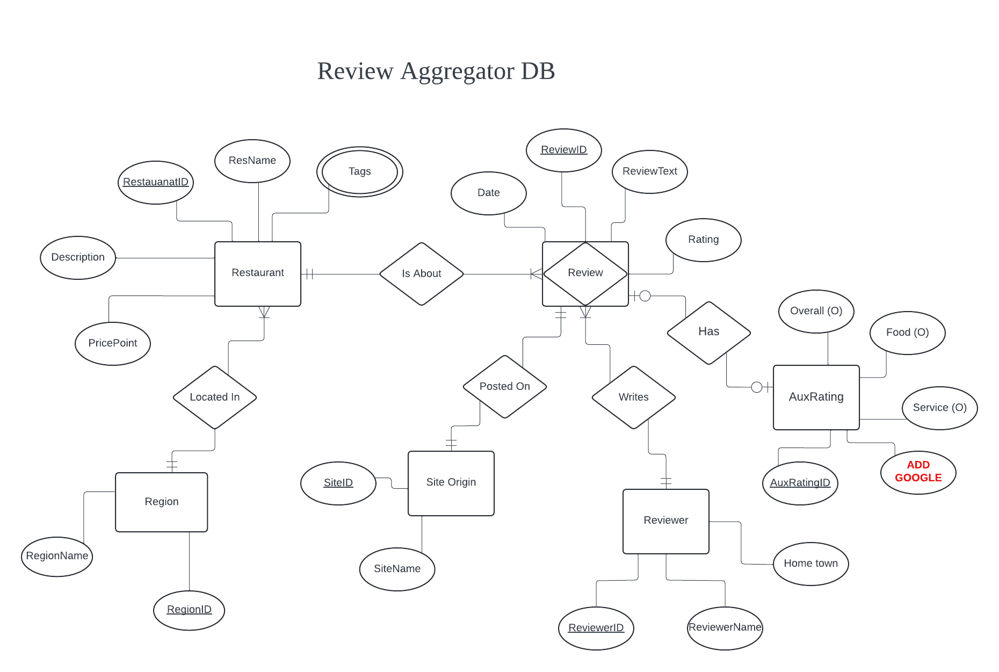
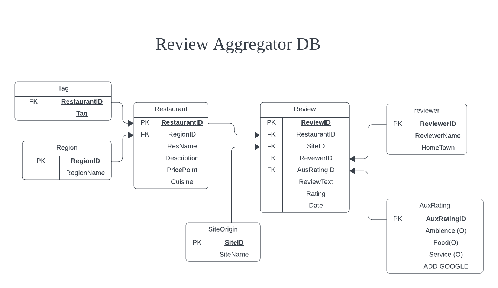

## README: Database Manager
___
This document outlines what data is being tracked in ```restaurant_review_database.db```, and how that data is organized. The relational schema can be used to design and write queries to access the data using SQL....
___


### Requirements:

Review Aggregator Database will keep track of the following:
* For each reviewer: a unique reviewer identifier, reviewer name, reviewer hometown.
* For each restaurant: a unique restaurant identifier, restaurant name, region, cuisine, tags, description, and price point.
* For each review: a unique review identifier, rating, date, and review text.
* For each region: a unique region identifier, and the region name.
* Each review has one reviewer, one restaurant, and one site origin. A reviewer can many reviews of different restuarants. A reviewer can have many reviews of the same restuarant.
* Each restaurant has at least one review, but can have many reviews.
* Each restaurant is from one region, a region can contain many restuarants.
* Each site origin has a least one review, but can have many.

___

### Entity Relationship Diagram:


___

### Resultant Relational Schema




