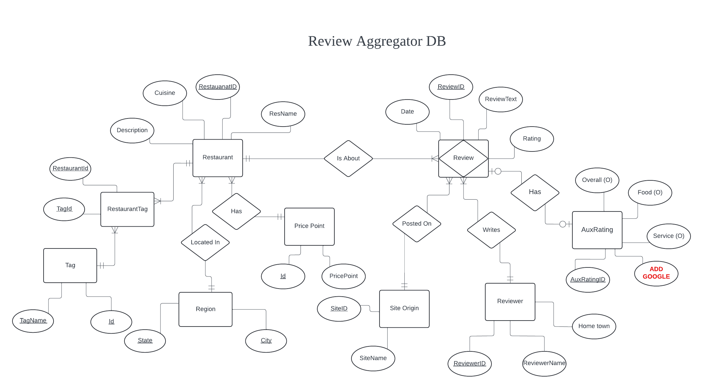
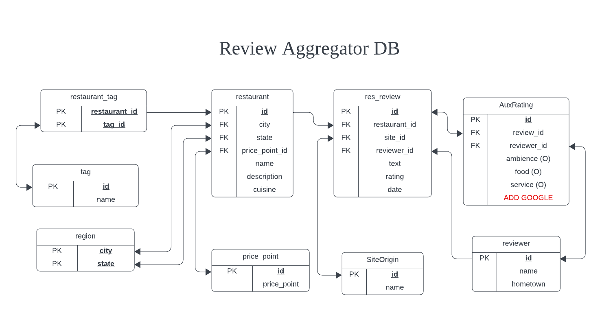

## README: Database Manager
___
This document outlines what data is being tracked in ```restaurant_review_database.db```, and how that data is organized. The relational schema can be used to design and write queries to access the data using ```database_manager_class.py``` and SQL.
___

### Requirements:

Review Aggregator Database will keep track of the following:
* For each reviewer: a unique reviewer identifier, reviewer name, reviewer hometown.
* For each restaurant: a unique restaurant identifier, restaurant name, region, cuisine, tags, description, and price point.
* For each review: a unique review identifier, rating, date, and review text.
* For each region: a unique region identifier, and the region name.
* Each review has one reviewer, one restaurant, and one site origin. A reviewer can many reviews of different restuarants. A reviewer can have many reviews of the same restuarant.
* Each restaurant has at least one review, but can have many reviews.
* Each restaurant is from one region, a region can contain many restuarants.
* Each site origin has a least one review, but can have many.

___

### Entity Relationship Diagram:


___

### Resultant Relational Schema


___
### ```database_manager_class.py```

This class is designed to insert the curated data into the database for easy access. Additional information is provided in the file. 

Data insertion requires $5$ arguments:  
1. The database file name.
2. The curated Yelp review data file name.
3. The curated OpenTable review data file name.
4. The curated Yelp rerestuarant data file name.
5. The curated OpenTable restaurant data file name.

**Example Usage:**

***Step 1: Set Parameters***
```python 
DB_FILE_NAME                = "restaurant_review_database.db"
YELP_REVIEW_DATA_FILE       = "yelp_review_data_Portland_ME_2024-06-29.csv_CURATED.csv"
YELP_RESTUARANT_DATA_FILE   = "yelp_restaurant_data_Portland_ME_2024-06-29_CURATED.csv"
OPEN_TABLE_REVIEW_DATE_FILE = "open_table_review_data_Portland_ME_2024-07-21.csv_CURATED.csv"
OPEN_TABLE_RES_DATE_FILE    = "open_table_restaurant_data_Portland_ME_2024-07-21.csv_CURATED.csv"
```  
***Step 2: Insert Data***
The order of the method invocation is important in this step.
```python
ResDB = RestaurantReviewDB(DB_FILE_NAME)
ResDB.connect()
ResDB.create_tables()
ResDB.set_open_table_data(OPEN_TABLE_REVIEW_DATE_FILE, OPEN_TABLE_RES_DATE_FILE)
ResDB.set_yelp_data(YELP_REVIEW_DATA_FILE, YELP_RESTUARANT_DATA_FILE)
ResDB.load_site_origin_table()
ResDB.load_region_table()
ResDB.load_tags_table()
ResDB.load_price_point_table()
ResDB.load_restuarant_table()
ResDB.load_res_tags_table()
ResDB.load_reviewer_table()
ResDB.load_restaurant_review_table()
ResDB.load_aux_rating_table()
```

***Step 3: Query***  
Once the data is inserted, queries can be performed using the ```query``` method.  
```python
# Define the query
query = """ 
        SELECT R.rating,
               R.date,
               Re.name,
               S.site_name
        FROM res_review AS R
        JOIN restaurant AS Re ON R.restaurant_id = Re.id
        JOIN site_origin AS S ON R.site_origin_id = S.id 
        """

# Execute query
result = ResDB.query(query)
print(result)
```
The output of the query is a ```pandas``` dataframe object.
```
       rating       date                name   site_name
0           5 2024-07-20      street and co.  open_table
1           5 2024-07-19      street and co.  open_table
2           3 2024-07-18      street and co.  open_table
3           4 2024-07-18      street and co.  open_table
4           5 2024-07-16      street and co.  open_table
...       ...        ...                 ...         ...
37989       5 2015-11-01  taj indian cuisine        Yelp
37990       4 2015-10-29  taj indian cuisine        Yelp
37991       4 2015-09-27  taj indian cuisine        Yelp
37992       1 2015-09-25  taj indian cuisine        Yelp
37993       5 2015-09-12  taj indian cuisine        Yelp
```

### ```data_base_driver.ipynb```  
The above examples are performed in ```data_base_driver.ipynb```. This notebook is designed is to interact with the database and perfrom EDA.


